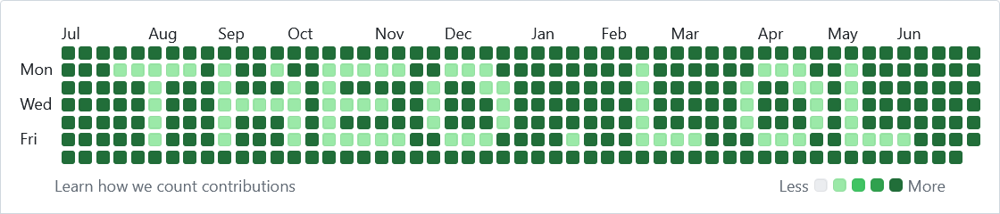

# GitHub Paint
yet another CLI to draw text in your GitHub contributions graph.



## Usage

> [!NOTE] 
> See [`action.yml`](./action.yml) for additional configuration documentation

1. [Create a GitHub Personal Access Token](https://github.com/settings/tokens) ([docs](https://docs.github.com/en/authentication/keeping-your-account-and-data-secure/managing-your-personal-access-tokens])) with **repo**, **read:user**, **user:email**, and **delete_repo** permissions (used to clean up previous repo commits and automatically retrieve necessary user information).
1. In a new or existing repository, store the access token as a GitHub secret under the key `GH_PAINT_PAT`
1. Create a workflow to invoke the action:

    `.github/workflows/github-paint.yml`
    ```yml
    name: Generate GitHub contributions graph
    on: 
    schedule:
        - cron: '0 0 * * *' # run daily if you care about having the graph coloring up-to-date
    workflow_dispatch: # or just run it manually every now and again
    jobs:
    build:
        runs-on: ubuntu-latest
        steps:
        - uses: tbrockman/github-paint@latest # or choose a specific semver (ex. tbrockman/github-paint@v1.0.1)
        with:
            text: theo.lol
            token: ${{ secrets.GH_PAINT_PAT }}
            # [optional]:
            # inverse: true # invert pixel color (darker <-> lighter)
            # git_email: 'abc@example.dev' # set a specific email for git author attribution (defaults to token user primary email)
            # git_name: theo # choose an alternate name for git author contribution (defaults to token user name)
            # repo: 'github-paint.theo.lol' # destination repository for the filler commits
            # start: 2020-01-01 # start of drawing window
            # end: 2025-12-12 # end of drawing window
            # repeat: false # repeat text as much as possible over the window
            # separator: "☺" # what to use as a separator when repeat=true
            # padding: (1,1,1,1) # (top,right,bottom,left) padding to add to the window (will clip content if necessary)
            # valign: center # text vertical alignment (top, center, bottom)
            # halign: center # text horizontal alignment (left, center, right)
            # dry_run: false # whether to actually perform write actions (manage commits or repos)
    ```
1. Execute the workflow (or wait for the cron to trigger)


## Development

### Prerequisites

* [`python`](https://www.python.org/downloads/)
* [`gh` cli](https://cli.github.com/)

### Clone the repo:

```bash
git clone https://github.com/tbrockman/github-paint
```

### Create a virtual environment:
```bash
python -m venv env
```

### Activate the environment:

#### Linux/MacOS
```bash
source env/bin/activate
```

#### Windows
```powershell
./env/Scripts/activate.ps1
```

### Install the dependencies:

```bash
pip install -r requirements.txt
```

### Run the CLI:

```bash
python main.py --help
```